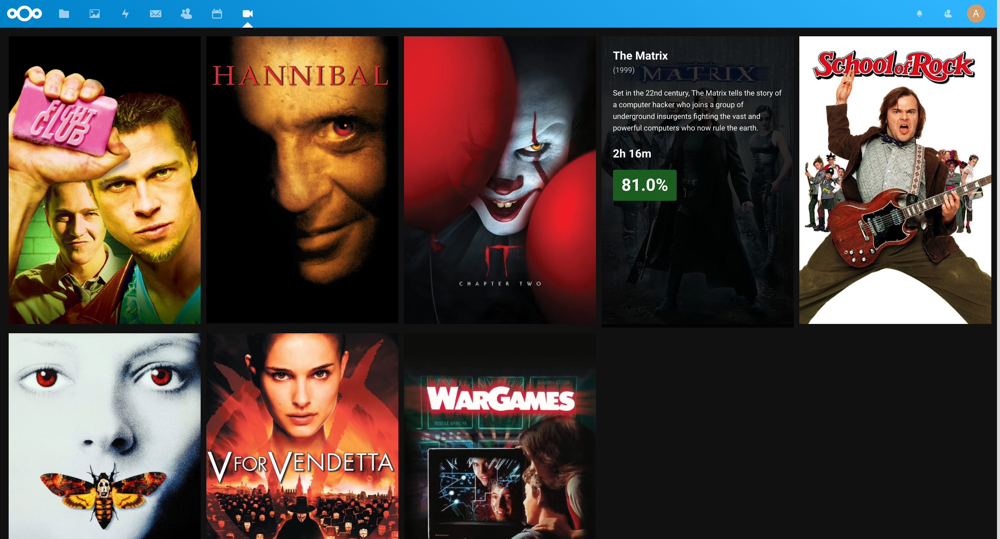
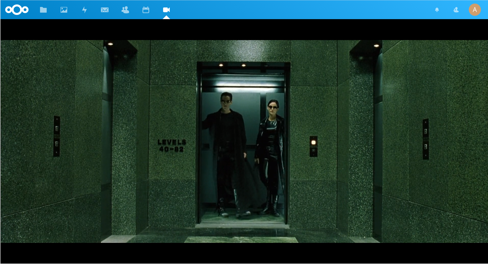
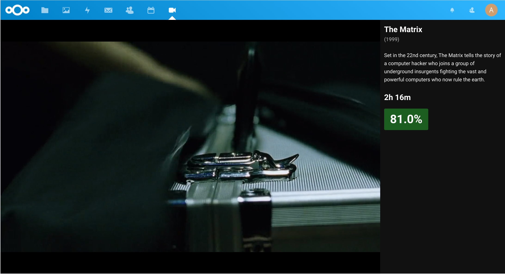

# Nextcloud Movies

**/!\ This app is not finished, and at his current point of development, still a concept. /!\**

A small Nextcloud app to watch movies, that feature a better video player (based on [plyr](https://plyr.io/)), automatically parse movies filename to retrieve information from TheMovieDB ([TMDb](https://www.themoviedb.org/?language=fr)). It use [parse-torrent-name-php](https://github.com/DEADF00D/parse-torrent-name-php) for movie filename parsing, and a custom TMDb wrapper for information retrieving (`TMDb.php`).

## Features

**Not currently implemented features are marked as TODO.**

- Plyr implementation for fullscreen, and picture-in-picture support.
- Automatic retriving from IMDb of the *Art*, *Title*, *Summary*, *User-Score*, and *Date of release* of each movies.
- Subtitle support. `TODO`
- Automatic fetch of new movies.

## Screenshots







## How to test it ?

```
git clone https://github.com/DEADF00D/Nextcloud-Movies.git
cp -r Nextcloud-Movies/movies /your-nextcloud-path/apps/
```

Log as Admin on your Nextcloud, then click on your profile > Applications > Movies, then enable it.

Nextcloud-Movies may create some cache files to store arts in the directory `.movies-cache` of your cloud root.
